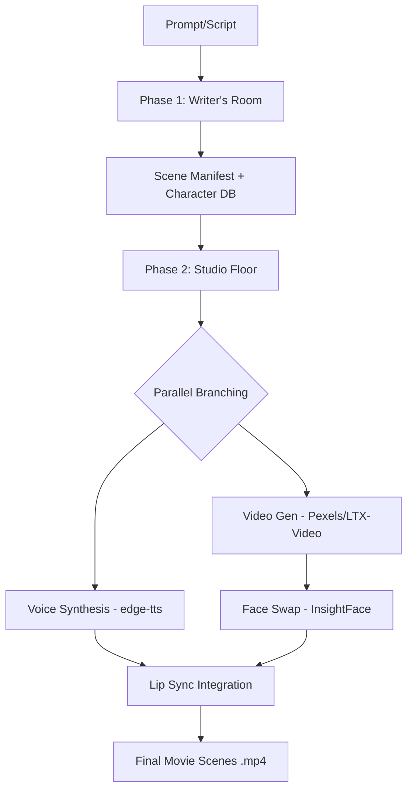

# PROJECT MONTAGE: Agentic AI Film Pipeline

**Project Montage** is an end-to-end, multi-agent AI pipeline that transforms abstract story prompts into fully rendered, character-consistent audiovisual content. The system is split into two primary phases: the **Writer's Room** (Phase 1) and the **Studio Floor** (Phase 2).

---

## System Architecture

### Phase 1: The Writer's Room (Assignment 3)
Transforms a high-level prompt or raw script into a structured screenplay and character database.
- **Agents:** Scriptwriter, Validator, Character Designer, Image Synthesizer.
- **Output:** `scene_manifest.json`, `character_db.json`, and high-quality Flux character portraits.

### Phase 2: The Studio Floor (Assignment 4)
Orchestrates a parallel audiovisual synthesis pipeline using LangGraph and MCP tools.
- **Agents:** Scene Parser, Voice Synth, Video Generator, Face Swapper, Lip Sync.
- **Output:** Final lip-synced `.mp4` scenes with character-consistent faces and speech.



---

## Multi-Method Execution

To ensure the highest visual fidelity, the pipeline runs multiple generation methods in parallel for every scene. This allows you to compare different AI "directors" side-by-side:

1.  **Pexels Stock Engine**: Fetches hyper-realistic 4K stock footage matching the visual atmosphere.
2.  **LTX-Video AI Engine**: Generates original synthetic video clips from text prompts.

Final artifacts are saved with methodology tags:
- `scene_01_pexels_final.mp4`
- `scene_01_hf_ai_final.mp4`

---

## Multimodal Architecture & Engines

Project Montage uses a multi-engine approach for every modality to ensure reliability and comparison.

| Component | Primary Engine | Secondary / Fallback | Mechanism |
| :--- | :--- | :--- | :--- |
| **Scripting** | **Gemini 2.0 Flash** | - | Structured JSON generation via LangGraph. |
| **Portraits** | **Flux-1.dev** | Stable Diffusion 2.1 | Character-consistent image synthesis (Pollinations). |
| **Voice** | **CosyVoice 2** | edge-tts / Kokoro | Zero-shot voice cloning from reference audio. |
| **Video** | **Wan 2.1** | LTX-Video / Pexels | T2V generation or Stock Footage retrieval. |
| **Face Swap** | **InsightFace** | Pass-through | Frame-by-frame face identity mapping. |
| **Lip Sync** | **SadTalker** | FFmpeg Audio Mux | AI facial animation or temporal audio alignment. |

---

## Resilience & Fallbacks

The pipeline is designed to be "always-functional." If a heavy AI model fails or an API is down, the system automatically falls back to simpler methods:

1.  **Voice Priority**: `CosyVoice2` (Cloning) → `edge-tts` (Neural) → `Kokoro` (Local) → `Tone WAV` (Pure Math).
2.  **Video Priority**: `Wan2.1` (Premium) → `LTX-Video` (AI Fallback) → `Pexels` (Stock Fallback) → `Black Screen`.
3.  **Lip Sync Priority**: `SadTalker` (AI Anim) → `FFmpeg Mux` (Sync Only) → `Raw Video`.

---

---

## Setup & Installation

1.  **Environment Configuration**:
    Create a `.env` file in the root:
    ```env
    GOOGLE_API_KEY=your_gemini_key
    HF_TOKEN=your_huggingface_token
    PEXELS_API_KEY=your_pexels_key
    DASHSCOPE_API_KEY=your_dashscope_key  # Optional for Wan2.1
    USE_VIDEO_MODEL=false                 # true for AI Video, false for Pexels
    USE_AI_ANIMATION=true                 # true for SadTalker, false for Mux
    ```

2.  **Install Core Dependencies**:
    ```powershell
    pip install -r requirements_phase2.txt
    ```

3.  **External Model Setup (Optional for high-quality modes)**:
    ```powershell
    # Clone Wav2Lip for local lip sync
    git clone https://github.com/Rudrabha/Wav2Lip.git external_models/Wav2Lip
    # Download checkpoints as per external_models/README (if present)
    ```

---

---

## Running the Pipeline

### Phase 1: Writer's Room (Script & Assets)
```powershell
python main.py
```
Generates `scene_manifest.json` and character portraits in `output/`.

### Phase 2: Studio Floor (Video Rendering)
```powershell
# Run the entire project (parallel processing)
python run_phase2.py

# Run only a specific scene
python run_phase2.py --scene-id 1

# Specify custom manifest or output paths
python run_phase2.py --manifest path/to/manifest.json --out my_render_folder
```

### Verification & Testing
Before a full run, verify your environment and model connectivity:
```powershell
python test_pipeline.py
```
This script checks API keys, imports, and runs a mini-pipeline test for each modality.

---

---

## Project Structure

- `agents/`: Custom LangGraph nodes for Phase 1 and 2.
- `models/`: Real model implementations (Voice, Video, Face Swap, Lip Sync).
- `tools/`: MCP Tool Registry and individual tool handlers.
- `memory/`: Persistent memory management via ChromaDB.
- `output/`: Phase 1 artifacts (Character portraits, JSON manifest).
- `output_phase2/`: Final Phase 2 artifacts (Audio tracks, MP4 scenes).

---
*Developed for the Agentic AI (CS-4015) Course Project.*