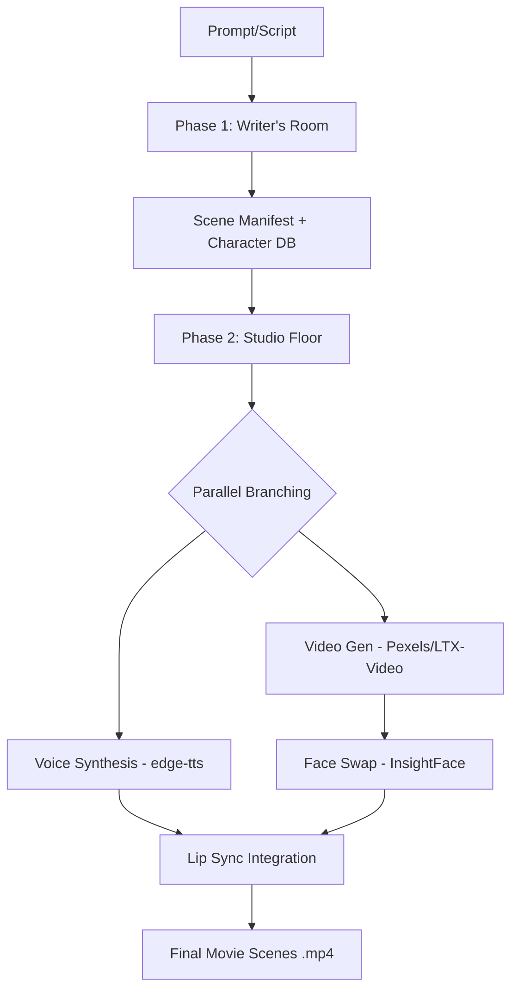

# PROJECT MONTAGE: Agentic AI Film Pipeline

**Project Montage** is an end-to-end, multi-agent AI pipeline that transforms story prompts into audiovisual scenes. **Phase 1** (Writer's Room) produces a structured manifest and character portraits; **Phase 2** (Studio Floor) synthesizes voice, stock/AI video, optional face swap, and lip-sync/mux into final MP4s.

---

## Repository layout

```
prompt-to-video/
├── agents/                 # LangGraph nodes
│   ├── audio_agent/        # TTS, per-scene WAV merge
│   ├── edit_agent/         # Phase 1 editing / HITL routing
│   ├── orchestrator/       # graph_phase1, graph_phase2, routing state
│   ├── story_agent/        # Script + character planning (Phase 1)
│   └── video_agent/        # Video gen, face swap, lip sync, memory commit
├── backend/                # FastAPI app + routes (phase1, phase2)
├── frontend/               # Vite + React UI (Phase 1 / Phase 2 pages)
├── mcp/                    # MCP tool registry + tools (audio, llm, system, video, vision)
├── scripts/                # run_phase2.py CLI entry for Phase 2
├── shared/
│   ├── schemas/            # TypedDict state (Phase 1 / Phase 2)
│   └── utils/              # scene_dialogue, media_paths, voice_mapping, output helpers
├── state_manager/          # Chroma + snapshots for Phase 1 memory
├── docs/                   # Assignment PDFs
├── data/outputs/           # Default artifact roots (phase1 / phase2); configurable via .env
├── main.py                 # Phase 1 CLI entry (montage workflow)
├── requirements.txt        # Python dependencies
└── .env                    # API keys & pipeline flags (not committed)
```

---

## System architecture

### Phase 1: Writer's Room

Structured screenplay, `scene_manifest.json`, `character_db.json`, and character portraits under `PHASE1_OUTPUT_DIR`.

### Phase 2: Studio Floor

Parallel scene branches: voice synthesis → video generation → face swap → lip sync (SadTalker or FFmpeg mux) → optional Chroma commit.



---

## Character DB extras (voice & swap)

Optional fields per character in `character_db.json` (also persisted when Phase 1 commits characters via `commit_memory`):

| Field | Purpose |
| :--- | :--- |
| `gender` | `male` / `female` / `neutral` (aliases: m/f, …) — picks Edge/Kokoro voice pool in `shared/utils/voice_mapping.py` |
| `edge_voice` | Explicit Edge voice id (e.g. `en-US-JennyNeural`) |
| `tts_voice` | Alias for `edge_voice` |
| `kokoro_voice` | Explicit Kokoro voice id |

**Primary speaker** for each scene is derived from **`dialogue`** line counts (`shared/utils/scene_dialogue.py`). That speaker’s portrait is preferred for video prompts, face swap, and SadTalker `source_image` when enabled.

---

## Multi-method video & lip sync

- **Video:** `VIDEO_GEN_METHODS` — comma-separated order (`pexels`, `hf_ai`, `dashscope`); first method that yields a clip ≥ `VIDEO_GEN_MIN_BYTES` wins.
- **Lip sync:** `USE_AI_ANIMATION` — `true` uses SadTalker (portrait + audio); `false` muxes stock video + dialogue WAV.

---

## Setup

1. Copy `.env.example` to `.env` and set keys (`GOOGLE_API_KEY`, `HF_TOKEN`, `PEXELS_API_KEY`, etc.).
2. Install dependencies:

```powershell
pip install -r requirements.txt
```

### Face swap (InsightFace) — do I need to set this up?

**Only if you want faces in the stock video replaced with your character portraits.** Phase 2 still runs without it: voice, video download, and lip-sync/mux all work. Face swap is optional glue on top.

**What must exist on disk**

The swap tool loads **`inswapper_128.onnx`** (InsightFace’s InSwapper model). By default it looks here:

- Path: **`INSIGHTFACE_MODEL_PATH`** in `.env` (see `.env.example`)
- Default if unset: **`./models/insightface/inswapper_128.onnx`** (relative to the process **current working directory**, usually the repo root when you run `scripts/run_phase2.py` or uvicorn from the project folder)

Create the folder `models/insightface/` under the repo root, download **`inswapper_128.onnx`** from the official InsightFace model distribution for InSwapper (same file name), and point **`INSIGHTFACE_MODEL_PATH`** at that file if you use a non-default location.

You also need **`insightface`** (and its deps, e.g. **OpenCV**) installed — covered by `requirements.txt` if listed there; if swap fails on import, install/fix those packages.

**What happens if the model is missing or fails to load**

The **`face_swapper`** tool does **not** stop the pipeline. It **copies the input video to the “swapped” output path unchanged**. Your Phase 2 logs may still say face swap ran, but **`scene_*_pexels_raw.mp4` and `scene_*_pexels_swapped.mp4` will look the same** (same pixels). That often reads as “face swap isn’t doing anything” — it isn’t, because there was nothing to run without **`inswapper_128.onnx`**.

**Summary**

| Goal | Action |
| :--- | :--- |
| Happy with Pexels faces only | **No** InsightFace setup required |
| Replace faces with character portraits | **Yes** — put **`inswapper_128.onnx`** on disk and set **`INSIGHTFACE_MODEL_PATH`** if needed |

---

## Running

**Phase 1**

```powershell
python main.py
```

**Phase 2** (loads repo-root `.env` regardless of cwd)

```powershell
python scripts/run_phase2.py
python scripts/run_phase2.py --scene-id 1
```

**API**

```powershell
python -m uvicorn backend.app:app --reload --host 127.0.0.1 --port 8000
```

Smoke checks:

```powershell
python scripts/test_pipeline.py
```

Artifacts default to `data/outputs/phase1` and `data/outputs/phase2` (override with `PHASE1_OUTPUT_DIR` / `PHASE2_OUTPUT_DIR`).

---

*Developed for the Agentic AI (CS-4015) Course Project.*
