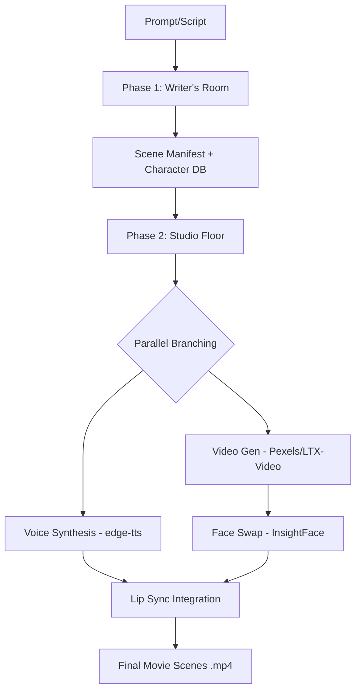

# 🎥 PROJECT MONTAGE: Agentic AI Film Pipeline

**Project Montage** is an end-to-end, multi-agent AI pipeline that transforms abstract story prompts into fully rendered, character-consistent audiovisual content. The system is split into two primary phases: the **Writer's Room** (Phase 1) and the **Studio Floor** (Phase 2).

---

## 🏗️ System Architecture

### Phase 1: The Writer's Room (Assignment 3)
Transforms a high-level prompt or raw script into a structured screenplay and character database.
- **Agents:** Scriptwriter, Validator, Character Designer, Image Synthesizer.
- **Output:** `scene_manifest.json`, `character_db.json`, and high-quality Flux character portraits.

### Phase 2: The Studio Floor (Assignment 4)
Orchestrates a parallel audiovisual synthesis pipeline using LangGraph and MCP tools.
- **Agents:** Scene Parser, Voice Synth, Video Generator, Face Swapper, Lip Sync.
- **Output:** Final lip-synced `.mp4` scenes with character-consistent faces and speech.



---

## 🎭 Multi-Method Execution

To ensure the highest visual fidelity, the pipeline runs multiple generation methods in parallel for every scene. This allows you to compare different AI "directors" side-by-side:

1.  **Pexels Stock Engine**: Fetches hyper-realistic 4K stock footage matching the visual atmosphere.
2.  **LTX-Video AI Engine**: Generates original synthetic video clips from text prompts.

Final artifacts are saved with methodology tags:
- `scene_01_pexels_final.mp4`
- `scene_01_hf_ai_final.mp4`

---

## 🚀 Key Technologies & Models

| Component | Technology / Model | Description |
| :--- | :--- | :--- |
| **Orchestration** | **LangGraph** | Manages stateful, parallel multi-agent workflows. |
| **Character Images** | **Flux** (via Pollinations) | High-fidelity character consistency. |
| **Voice / Speech** | **edge-tts** | Professional neural TTS with emotion-aware pacing. |
| **Video Source** | **Pexels API** | Accurate stock footage search based on visual cues. |
| **AI Video** | **LTX-Video** | HuggingFace serverless text-to-video generation. |
| **Face Swap** | **InsightFace** | Frame-by-frame character face mapping. |
| **Lip Sync** | **SadTalker** | AI talking-head animation via Gradio API. |
| **Memory** | **ChromaDB** | Persistent storage for resumable task graphs. |

---

## 🛠️ Setup & Installation

1. **Environment Configuration**:
   Create a `.env` file in the root with the following keys:
   ```env
   GOOGLE_API_KEY=your_gemini_key
   HF_TOKEN=your_huggingface_token
   PEXELS_API_KEY=your_pexels_key
   USE_VIDEO_MODEL=false     # true for LTX-Video, false for Pexels
   USE_AI_ANIMATION=true     # true for SadTalker, false for FFmpeg Mux
   ```

2. **Install Dependencies**:
   ```powershell
   pip install langgraph chromadb pydantic python-dotenv
   pip install pillow requests gradio_client edge-tts opencv-python
   ```

---

## 🎬 Running the Pipeline

### Step 1: Generate the Script (Phase 1)
```powershell
python main.py
```
This produces the `scene_manifest.json` and character portraits in `output/`.

### Step 2: Render the Video (Phase 2)
```powershell
# Run a specific scene
python run_phase2.py --scene-id 1

# Run all scenes
python run_phase2.py
```
Outputs are saved to `output_phase2/raw_scenes/`.

---

## 📁 Project Structure

- `agents/`: Custom LangGraph nodes for Phase 1 and 2.
- `models/`: Real model implementations (Voice, Video, Face Swap, Lip Sync).
- `tools/`: MCP Tool Registry and individual tool handlers.
- `memory/`: Persistent memory management via ChromaDB.
- `output/`: Phase 1 artifacts (Character portraits, JSON manifest).
- `output_phase2/`: Final Phase 2 artifacts (Audio tracks, MP4 scenes).

---
*Developed for the Agentic AI (CS-4015) Course Project.*
