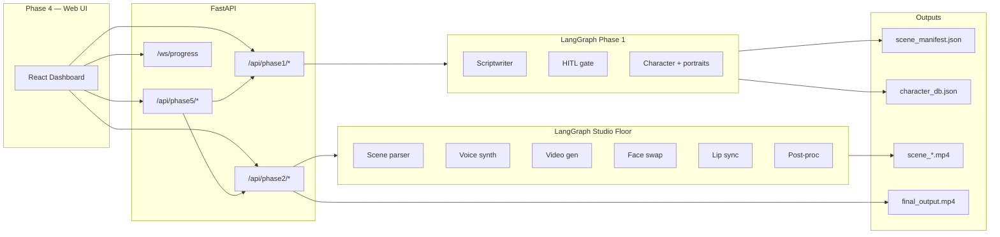

# Project Montage — AI-Powered Animated Video Generation

**Agentic AI (CS-4015) — Semester Project 2026**  
*National University of Computer and Emerging Sciences (FAST-NUCES), Islamabad*

Project Montage is a full-stack, **multi-agent** system that turns a single natural-language prompt into a **short animated-style film**: structured story and dialogue, character-specific voices, per-scene video, optional face consistency and lip sync, and a **composited MP4** with transitions, background music, and subtitles. A **Phase 5 edit agent** parses free-text instructions into structured intents and coordinates **targeted re-runs** or **lightweight FFmpeg-style fixes**, with **snapshot-based history** for revert workflows.

This repository is organized for **modular phases**, shared **JSON-oriented contracts**, and **independent testing**, aligned with the course specification (story/script, audio, video composition, web UI, edit agent with undo-oriented state).

---

## Table of contents

1. [Problem and goals](#problem-and-goals)  
2. [How it works (phases)](#how-it-works-phases)  
3. [System architecture](#system-architecture)  
4. [Repository structure](#repository-structure)  
5. [Artifacts and directories](#artifacts-and-directories)  
6. [JSON schemas and file formats](#json-schemas-and-file-formats)  
7. [Backend API](#backend-api)  
8. [WebSocket progress](#websocket-progress)  
9. [Technology stack](#technology-stack)  
10. [Prerequisites](#prerequisites)  
11. [Setup and how to run](#setup-and-how-to-run)  
12. [Testing](#testing)  
13. [Configuration](#configuration)  
14. [Course alignment](#course-alignment)  
15. [Further documentation](#further-documentation)

---

## Problem and goals

Producing even a short animated video typically involves writers, voice talent, illustrators, and editors. Generative models now cover language, speech, and video, but tying them together with **orchestration**, **structured interchange formats**, and a **usable UI** is non-trivial.

This project demonstrates:

- **LangGraph** workflows with explicit state types and branching (including human-in-the-loop approval).
- **Heterogeneous APIs** (LLMs, stock video, generative video, TTS, optional CV models) behind a single pipeline.
- **Structured outputs** (Pydantic models, JSON manifests, intent objects).
- A **React** dashboard that drives the API and shows live progress.
- **Versioned snapshots** of state (and copied assets) to support edit / revert demos.

---

## How it works (phases)

| Phase | Name (course) | Role in this codebase |
| :--- | :--- | :--- |
| **1** | Story and script generation | LangGraph **Phase 1** graph: scriptwriter → HITL checkpoint → character design → portrait synthesis → persistence under `data/outputs/phase1/`. |
| **2** | Audio generation | Per-scene **TTS**, mixing, SFX/BGM tooling via **MCP tools** and `voice_synth_node` in the Studio Floor graph. |
| **3** | Video composition | Per-scene **stock / AI video**, optional **InsightFace** swap and **SadTalker** (or FFmpeg mux), then **`POST /api/phase2/compose`** merges scenes into `final_output.mp4` with transitions, BGM, subtitles. |
| **4** | Web interface | **Vite + React 19** app (`frontend/`): Phase 1 HITL, Phase 2 run / compose / playback, edit panel calling Phase 5 APIs, WebSocket progress. |
| **5** | Edit agent (+ undo support) | **Intent classifier** (`agents/edit_agent/intent_classifier.py`) maps natural language to `{ intent, target, scope, parameters }`. **`/api/phase5/execute`** routes to script/audio/video regeneration or **post-proc-only** paths. **`StateManager`** snapshots under `data/snapshots/`; **`/revert`** restores saved state. |

---

## System architecture

High-level data flow:



**Orchestration**

- **Phase 1** (`agents/orchestrator/graph_phase1.py`): `MemorySaver` checkpointer; interrupts **before** `Hitl_node` so the API can return `awaiting_hitl` and resume after `POST /api/phase1/hitl/approve`.
- **Studio Floor** (`agents/orchestrator/graph_phase2.py`): parses manifest → voice synthesis → parallel video branches → face swap → lip sync → post-proc → memory commit. **Final assembly** is intentionally triggered separately via **`POST /api/phase2/compose`** (Phase 3-style composition).

**Tooling layer**

- **`mcp/`**: registry (`tool_registry.py`, `tool_executor.py`) and **tools** for LLM structuring, TTS, FFmpeg, compositing, video generation, face swap, lip sync, image gen, audio FX, etc. Phase graphs and routes **register** tools at startup.

**State and memory**

- **`state_manager/`**: Chroma-backed helpers (`memory_manager.py`) and **`StateManager`** snapshot/revert (`snapshot.py`) used by Phase 5 routes.

---

## Repository structure

```
prompt-to-video/
├── agents/
│   ├── audio_agent/          # TTS / scene audio pipeline nodes
│   ├── edit_agent/           # HITL/validator hooks, intent classifier, planners, executor
│   ├── orchestrator/         # graph_phase1.py, graph_phase2.py, routing helpers
│   ├── post_proc_agent/      # Surgical audio/video FX via tools (e.g. FFmpeg)
│   ├── story_agent/          # Scriptwriter, character design, image synthesis nodes
│   └── video_agent/          # Video gen, face swap, lip sync, compositor nodes
├── backend/
│   ├── app.py                # FastAPI app, CORS, routers, WebSocket
│   ├── routes/               # phase1.py, phase2.py, phase5.py
│   └── websocket/            # Progress broadcast manager
├── frontend/                 # Vite + React + Tailwind v4 dashboard
├── mcp/                      # Tool registry + concrete tools (audio, video, vision, llm, system)
├── shared/
│   ├── schemas/              # MontageState, StudioState (TypedDict / Pydantic models)
│   └── utils/                # LLM client, paths, progress reporting, output helpers, …
├── state_manager/            # Snapshots, Chroma DB files, storage helpers
├── scripts/
│   ├── run_phase2.py         # CLI: Studio Floor from Phase 1 artifacts
│   └── test_pipeline.py      # Scripted multi-phase smoke test
├── tests/unit/               # pytest modules per phase/tooling
├── data/                     # outputs, snapshots (gitignored paths — see .gitignore)
├── docs/                     # assignment PDFs + internal notes
├── main.py                   # Phase 1 CLI entry (invokes Phase 1 graph + save_outputs)
├── requirements.txt          # Python dependencies (see Setup — FastAPI stack installed separately)
└── .env.example              # Documented environment variables
```

---

## Artifacts and directories

| Path | Contents |
| :--- | :--- |
| `data/outputs/phase1/` | `scene_manifest.json`, `character_db.json`, `image_assets/*.png` |
| `data/outputs/phase2/` | Intermediate audio/video; `final_scenes/scene_<id>.mp4` |
| `data/outputs/final_output.mp4` | Composed film after **compose** |
| `data/outputs/phase3/` | `composition_metadata.json` (when written by compositor) |
| `data/snapshots/` | Version folders + `history.json` for Phase 5 |

Configurable via `.env`: `PHASE1_OUTPUT_DIR`, `PHASE2_OUTPUT_DIR` (defaults shown in `.env.example`).

---

## JSON schemas and file formats

### Shared types (`shared/schemas/state.py`)

**`Scene` (Pydantic)**

| Field | Type | Description |
| :--- | :--- | :--- |
| `scene_id` | `int` | Scene index |
| `location` | `str` | Location / slug line |
| `characters` | `list[str]` | Characters present |
| `dialogue` | `list[dict]` | Items with `speaker`, `line`, `visual_cue` (and optionally `emotion` / fields merged by the edit agent) |

**`Character` (Pydantic)**

| Field | Type | Description |
| :--- | :--- | :--- |
| `name` | `str` | Character name |
| `personality` | `str` | Narrative personality |
| `appearance` | `str` | Visual description |
| `voice_profile` | `str` | Voice brief |
| `reference_style` | `str` | Art direction hint |
| `gender` | `str \| null` | Optional: `"male"` \| `"female"` \| `"neutral"` |
| `image_path` | `str \| null` | Portrait path when generated |

**`MontageState` (TypedDict)** — Phase 1 graph state: includes `user_prompt`, `input_mode` (`manual` \| `auto`), `hitl_approved`, `raw_script`, `scenes`, `characters`, `status`, `errors`, `current_agent`, and artifact paths (`scene_manifest_path`, `character_db_path`, `image_assets_dir`).

### Studio Floor (`shared/schemas/phase2_state.py`)

**`StudioState` (TypedDict)** — keys include:

- Inputs: `scene_manifest_path`, `output_root`, `character_db`, `scene_id_filter`, `skip_video`, `skip_all_gen`, `post_proc_map`
- Planning: `scenes`, `task_graph`, `scene_jobs`
- Reducers: `audio_tracks`, `video_tracks`, `face_swaps`, `final_scenes`, `task_logs`, `errors` (annotated with `operator.add` where applicable)
- Output: `final_output_path`
- Control: `status`, `current_agent`

### On-disk Phase 1 JSON

**`scene_manifest.json`**

```json
{
  "scenes": [
    {
      "scene_id": 1,
      "location": "INT. CAFE - DAY",
      "characters": ["Alex"],
      "dialogue": [
        {
          "speaker": "Alex",
          "line": "Hello there.",
          "visual_cue": "Alex waves cheerfully."
        }
      ]
    }
  ]
}
```

**`character_db.json`**

```json
{
  "characters": [
    {
      "name": "Alex",
      "personality": "...",
      "appearance": "...",
      "voice_profile": "...",
      "reference_style": "...",
      "gender": "neutral",
      "image_path": "data/outputs/phase1/image_assets/alex.png"
    }
  ]
}
```

### Phase 5 intent object (`agents/edit_agent/intent_classifier.py`)

The classifier prompts the LLM to return **only JSON** with this shape:

```json
{
  "intent": "pitch_shift",
  "target": "audio_fx",
  "scope": "character:Alex",
  "parameters": {
    "pitch": 0.8,
    "filter_type": "radio",
    "brightness": -0.2,
    "speed": 1.0
  },
  "explanation": "Brief reasoning"
}
```

**`target`** must be one of: `audio`, `audio_fx`, `video_frame`, `video_fx`, `video`, `script`.  
**`scope`** examples: `global`, `scene:1`, `character:Alex`.

---

## Backend API

Base URL (local): `http://127.0.0.1:8000` — the frontend currently calls `http://localhost:8000` explicitly.

### Phase 1 — `/api/phase1`

| Method | Path | Description |
| :--- | :--- | :--- |
| `POST` | `/run` | Body: `{ "prompt": "<text>" }`. Runs graph until HITL or completion. Returns `awaiting_hitl` with `data.script.scenes` when paused. |
| `POST` | `/hitl/approve` | Body: `{ "approved": true \| false }`. Resumes graph (runs in a worker thread so WebSocket progress stays responsive). |
| `GET` | `/character-image/{name}` | Serves portrait PNG from `data/outputs/phase1/image_assets/`. |
| `GET` | `/script` | Returns parsed `scene_manifest.json`. |
| `GET` | `/characters` | Returns `character_db.json` characters array. |

### Phase 2 & composition — `/api/phase2`

| Method | Path | Description |
| :--- | :--- | :--- |
| `POST` | `/run` | Body: `{ "scene_id": null \| int, "skip_video": bool, "post_proc_map": {} }`. Invokes Studio Floor graph. |
| `POST` | `/compose` | Query: `transition`, `transition_duration`, `enable_bgm`, `enable_subtitles`, `bgm_volume`. Merges `final_scenes/scene_*.mp4` into `data/outputs/final_output.mp4`. |
| `GET` | `/final` | Downloads / streams `final_output.mp4`. |
| `GET` | `/final/status` | Size + optional `composition_metadata.json`. |
| `GET` | `/outputs` | Lists generated scene videos. |
| `GET` | `/video/{scene_id}` | Streams `scene_{id}.mp4`. |

### Phase 5 — `/api/phase5`

| Method | Path | Description |
| :--- | :--- | :--- |
| `POST` | `/intent` | Body: `{ "query": "<edit text>", "current_state": { ... } }` → structured intent. |
| `POST` | `/snapshot` | Body: `{ "version", "state", "summary" }` → persists state + asset copies. |
| `GET` | `/history` | Lists snapshot history entries. |
| `POST` | `/revert` | Body: `{ "version": "<id>" }` → restored state JSON. |
| `POST` | `/execute` | Body: `{ "intent_obj": { ... }, "state": { ... } }` → routes regeneration / compositor / post-proc; returns `next_step` hints for the client. |

---

## WebSocket progress

- **URL:** `ws://localhost:8000/ws/progress`
- **Handler:** `backend/websocket/manager.py` — used by the React hook `frontend/src/hooks/useProgress.ts` for live pipeline updates.

---

## Technology stack

| Area | Technologies |
| :--- | :--- |
| Orchestration | **LangGraph**, **LangChain Core**, checkpointing (`MemorySaver`) |
| LLMs | **Groq** (OpenAI-compatible, default `llama-3.3-70b-versatile`), **Google Gemini** (`google-generativeai`, **LangChain Google GenAI** for some agents); configurable via `LLM_PROVIDER`, `GROQ_API_KEY`, `GEMINI_API_KEY` |
| Structured data | **Pydantic** v2, **TypedDict**, JSON manifests |
| Backend | **FastAPI**, **Uvicorn**, **python-dotenv** |
| Frontend | **React 19**, **Vite 8**, **React Router 7**, **Tailwind CSS v4** |
| Audio | **edge-tts**, **Kokoro**, **soundfile**; tooling in `mcp/tools/audio_tools/` |
| Video / FX | **FFmpeg** (via custom tools), **OpenCV** (headless), compositor + subtitle tooling |
| Stock / gen video | **Pexels**, **Hugging Face** (e.g. LTX-Video), **DashScope / Wan2.1** (optional) |
| Vision / animation | **InsightFace** + **ONNX Runtime**; **SadTalker** via **Gradio Client** (HF Space); optional **Pollinations** / HF image models for portraits |
| Memory / snapshots | **ChromaDB**; filesystem snapshots under `data/snapshots/` |
| Language runtime | **Python 3** (see your environment); **Node.js** for the frontend |

External services require keys as documented in **`.env.example`**.

---

## Prerequisites

- **Python 3.10+** recommended (match your course environment).
- **Node.js 18+** (for Vite).
- **FFmpeg** available on `PATH` (used by video/audio tools).
- API keys as needed: Groq and/or Gemini, Hugging Face, Pexels, optional DashScope.
- For face swap: InsightFace **inswapper** ONNX weights at `INSIGHTFACE_MODEL_PATH` (see `.env.example`).
- GPU optional but helpful for local ONNX / some HF workflows.

---

## Setup and how to run

### 1. Clone and environment

```bash
cd prompt-to-video
python -m venv .venv
# Windows PowerShell:
.\.venv\Scripts\Activate.ps1
pip install -r requirements.txt
pip install "fastapi" "uvicorn[standard]" pytest
```

Copy **`.env.example`** to **`.env`** and fill in keys. The backend loads `.env` from the **repository root**.

> **Note:** Root `requirements.txt` lists the scientific / ML stack; **FastAPI** and **Uvicorn** are required for `backend.app` but are not currently pinned in that file—install them as above (or add them to your environment).

### 2. Backend API

From the repo root:

```bash
python -m uvicorn backend.app:app --reload --host 127.0.0.1 --port 8000
```

This registers MCP tools and exposes REST + WebSocket endpoints.

### 3. Frontend

```bash
cd frontend
npm install
npm run dev
```

Open the URL Vite prints (typically `http://localhost:5173`). Ensure the API is on **port 8000** or update fetch URLs in `frontend/src/pages/Phase1.tsx`, `Phase2.tsx`, `components/EditPanel.tsx`, and `hooks/useProgress.ts`.

### 4. CLI entries

| Command | Purpose |
| :--- | :--- |
| `python main.py` | Invokes the **Phase 1** LangGraph once with the sample prompt embedded in `main.py`. For HITL and on-disk artifacts aligned with Phase 2, prefer **`POST /api/phase1/run`** (manifests and `character_db.json` are written under `PHASE1_OUTPUT_DIR` via the `commit_memory` MCP tool). |
| `python scripts/run_phase2.py` | Runs **Studio Floor** using Phase 1 artifacts on disk (`--help` for options). |
| `python scripts/test_pipeline.py` | Shortened pipeline smoke test (adjust env such as `NUMBER_OF_SCENES` for cost/time). |

---

## Testing

Unit tests live under **`tests/unit/`**:

- `test_script_schema.py` — script JSON parsing / `Scene` validation paths  
- `test_audio_agent.py`, `test_video_gen_tool.py`, `test_sfx_tool.py` — tooling and agents  
- `test_intent_agent.py` — edit intent behavior  

Run from repo root:

```bash
pytest tests/unit -v
```

---

## Configuration

All significant toggles are documented in **`.env.example`**, including:

- LLM provider and models (`LLM_PROVIDER`, `LLM_MODEL`, `GROQ_API_KEY`, `GEMINI_API_KEY`)
- Video generation order (`VIDEO_GEN_METHODS`, Pexels / HF / DashScope keys)
- `USE_AI_ANIMATION` — SadTalking head vs FFmpeg mux with stock video
- `HITL_AUTO_APPROVE`, `NUMBER_OF_SCENES`, output directories
- HF image model lists and optional Pollinations tuning variables

Restart **Uvicorn** after changing environment variables loaded at startup.

---

## Course alignment

This README maps directly to the **Agentic AI Project 2026** requirements:

- **Phase 1–5** implemented as modular stages with clear contracts.  
- **Root README** (this file): overview, stack, setup, execution.  
- **Dependencies:** `requirements.txt` (+ documented FastAPI/Uvicorn install).  
- **JSON schema design:** shared schemas + on-disk manifests + Phase 5 intent object.  
- **Unit tests:** under `tests/unit/`.  
- **Demo expectations:** full prompt → video pipeline via UI; edit agent + snapshot/revert via Phase 5 APIs (see assignment PDF in `docs/` for submission checklist).

---

## Further documentation

- **`docs/Agentic AI Final Project - 2026.pdf`** — official brief, submission rules, and rubric context.  
- **`backend/README.md`** and **`frontend/README.md`** — component-local notes if present.  
- **`docs/REMAINING_TASKS.md`** — internal tracker for unfinished items.

---

*Developed for Agentic AI (CS-4015), FAST-NUCES Islamabad — Project Montage.*
